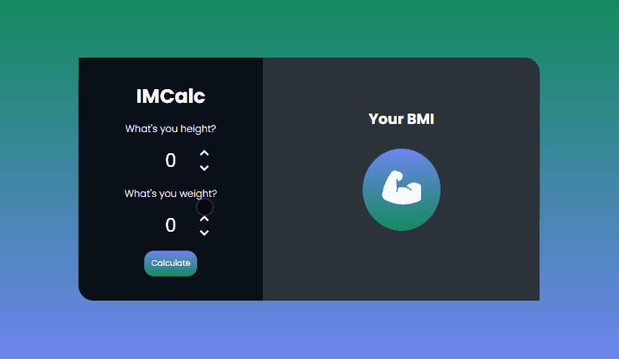
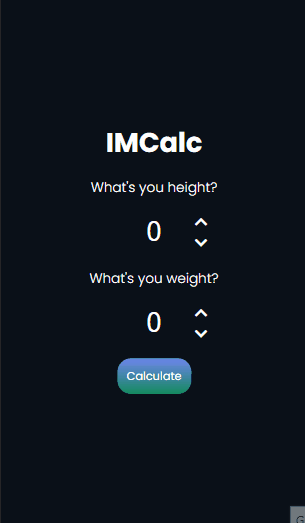
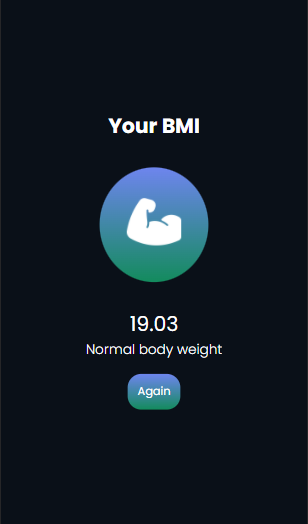

<h1 align="center">IMCalc</h1>

<h2 align="center">
    
</h2>

A very efficient BMI calculator

<h4 align="center"> 
	🚧  Finished ! 🚧
</h4>

 

## 💻 About the project

 

BMICalc is a very efficient and to-the-point BMI calculator where you can quickly check if you have a good Body Mass Index just by entering your height and weight.

 

## 🎨 Interface

 

### Desktop

  

 

### Mobile

    
    

 

 

## 👩🏻 Autor

Made with 💜 by Evelyn Monteiro 👋
 

